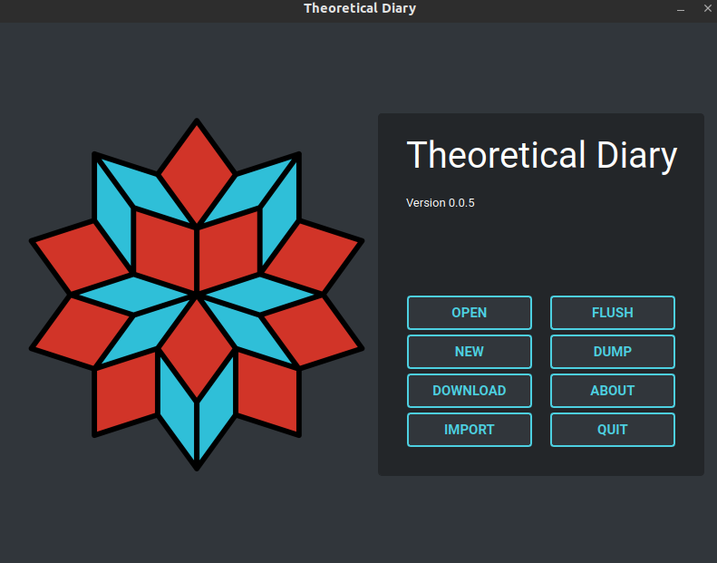
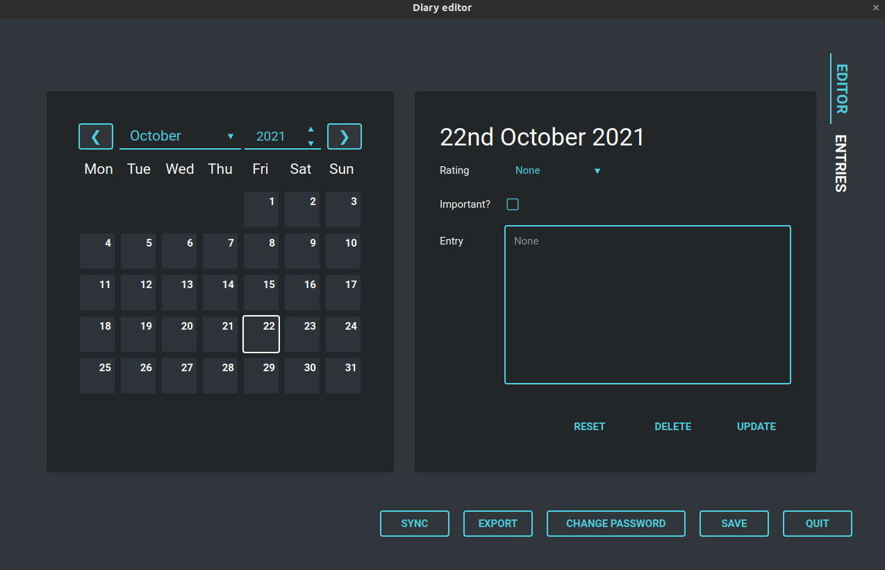

# Theoretical Diary

## About

A digital diary with (planned) Google Drive backups. This app is a work in progress

## Images

## Download

### Windows

For Windows, the prebuilt binaries are available in `theoreticaldiary-x64` (check the result of the latest successful Github actions for [`windows.yml`](https://github.com/someretical/theoretical-diary/actions/workflows/windows.yml)). The only platform it is guaranteed to work on is Windows 10 x64.

### Linux

For Linux, the prebuilt app image is available in `theoreticaldiary-linux` (check the result of the latest successful Github actions for [`linux.yml`](https://github.com/someretical/theoretical-diary/actions/workflows/linux.yml)). Due to package version requirements, the app image will only work from Ubuntu 20.04  onwards.

### MacOS

In theory it is possible to deploy to MacOS but I'm not bothered enough to figure out how to do so. PRs are welcome.

## Building

### Windows

My main development platform is not Windows so the best I can say is to take a look at [`windows.yml`](https://github.com/someretical/theoretical-diary/blob/master/.github/workflows/linux.yml) to see how to build it.

### Linux

Check out [`linux.yml`](https://github.com/someretical/theoretical-diary/blob/master/.github/workflows/linux.yml) for how to build your own app image.
