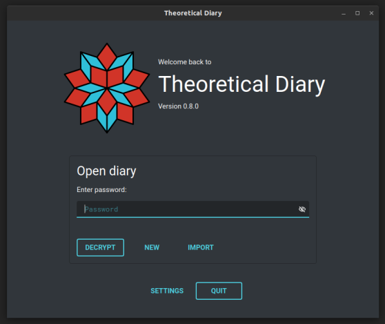
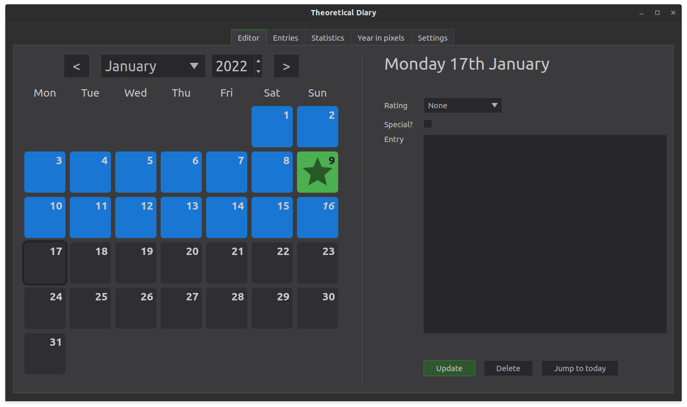
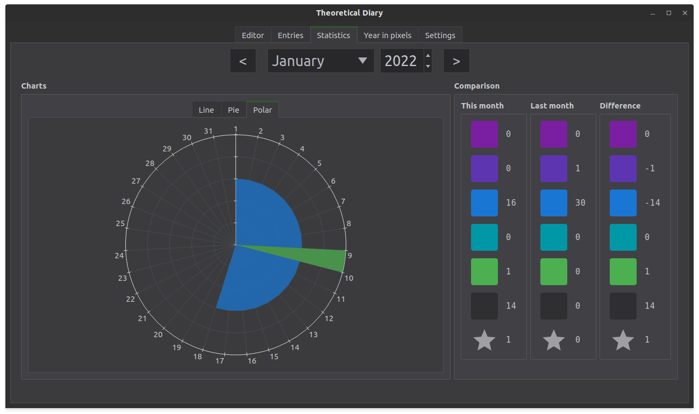
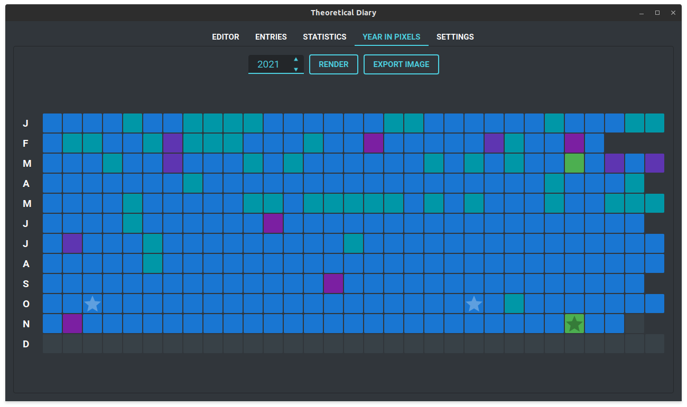
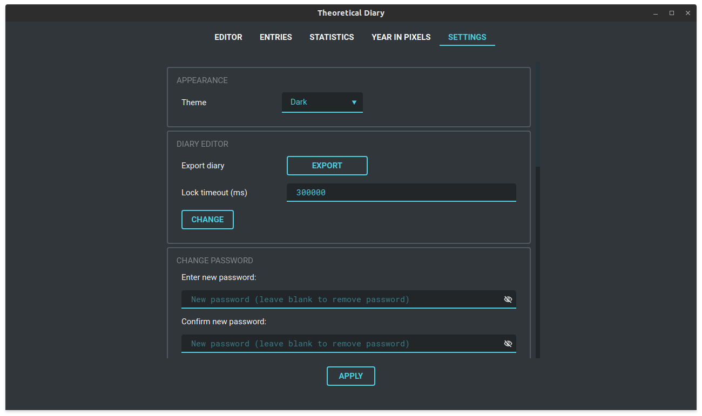
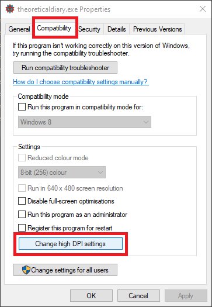
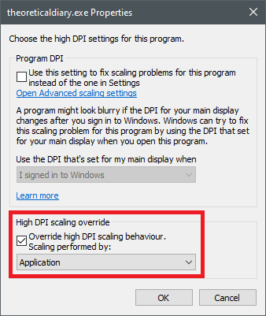

# Theoretical Diary

## About

A digital diary with Google Drive backups. This app is currently feature complete. New non-essential features may be added over time.

## Images

## Installation

### Windows

For Windows, the prebuilt binaries are available in `theoreticaldiary-x86_64` (check the result of the latest successful Github actions for [`windows.yml`](https://github.com/someretical/TheoreticalDiary/actions/workflows/windows.yml)). The only platform it is guaranteed to work on is Windows 10 x64.

To fix scaling issues on Windows, follow these instructions:

1. Download and extract the ZIP file.
2. Right click the executable file and select `Properties`.
3. Click on the `Compatability` tab and then click on `Change high DPI settings`.
4. Then tick the override checkbox and make sure the dropdown option is set to `Application`.
5. Click `OK` and then click `Apply` to save the changes.

### Linux

For Linux, the prebuilt app image is available in `theoreticaldiary-x86_64` (check the result of the latest successful Github actions for [`linux.yml`](https://github.com/someretical/TheoreticalDiary/actions/workflows/linux.yml)). Due to package version requirements, the app image will only work from Ubuntu 20.04 onwards.

### MacOS

In theory it is possible to deploy to MacOS but I'm not bothered enough to figure out how to do so. Pull requsts are welcome on this matter.

## Building

### Windows

My main development platform is not Windows so the best I can say is to take a look at [`windows.yml`](https://github.com/someretical/TheoreticalDiary/blob/master/.github/workflows/linux.yml) to see how to build it.

### Linux

Check out [`linux.yml`](https://github.com/someretical/TheoreticalDiary/blob/master/.github/workflows/linux.yml) for how to build your own app image.
